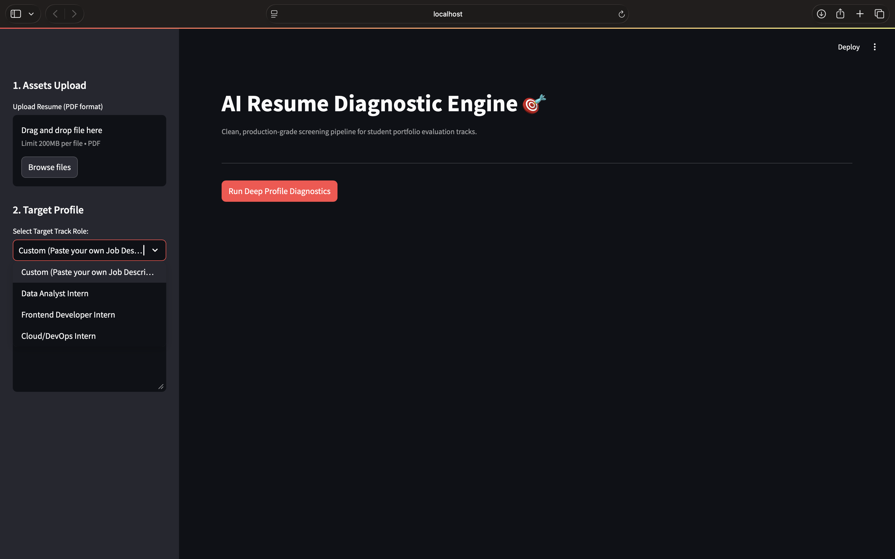
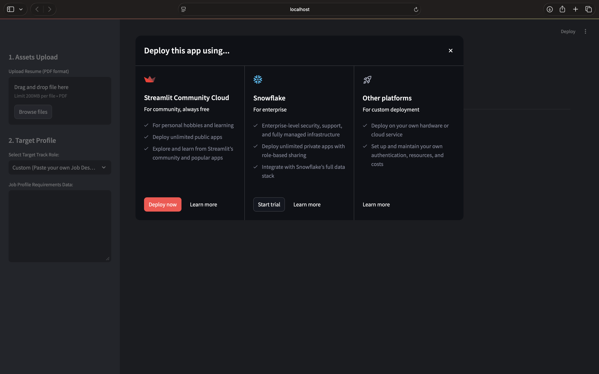

# 🤖 AI Resume Analyzer
🚀 **[Live Demo](https://nancy-ai-resume-analyzer.streamlit.app)**

Try the live AI Resume Analyzer without installing anything locally.

An AI-powered resume analysis tool that helps job seekers understand how well their resume matches a target job description.

## 🎯 What Problem Does It Solve?

Many resumes contain good experience but do not clearly match the requirements of a particular job.

This project helps users:

- Analyze their resume
- Compare their resume with a job description
- Identify relevant keywords
- Find missing keywords
- Calculate a resume match score
- Get suggestions for improvement

## ✨ Features

- 📄 Resume text extraction from PDF files
- 🎯 Job description matching
- 🔎 Keyword analysis
- 📊 Resume match score
- 💡 Resume improvement suggestions
- 🖥️ Simple and interactive web interface
- ⚡ Fast analysis using Python

## 🔄 How It Works

1. Upload your resume in PDF format.
2. The application extracts the resume text.
3. Enter the target job description.
4. The application analyzes the resume and job description.
5. Resume content is compared with the job requirements.
6. A match score is calculated.
7. Relevant and missing keywords are identified.
8. Suggestions are displayed to help improve the resume.

## 🛠️ Tech Stack

- Python
- Streamlit
- PyPDF2
- Scikit-learn

## 📸 Screenshots

### Dashboard



### Analysis Results



## 🚀 Installation
pip install -r requirements.txt

### 1. Clone the repository

```bash
MAC/Linux
python3 -m venv .venv
source .venv/bin/activate

Windows
python -m venv .venv
.venv\Scripts\activate

Run the application
streamlit run app.py

Run the application
streamlit run app.py

Open the application
Open the local URL shown in your terminal.
Usually:
http://localhost:8501
