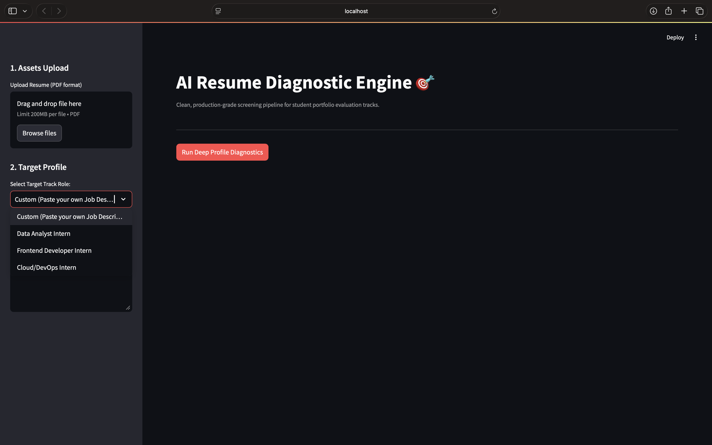
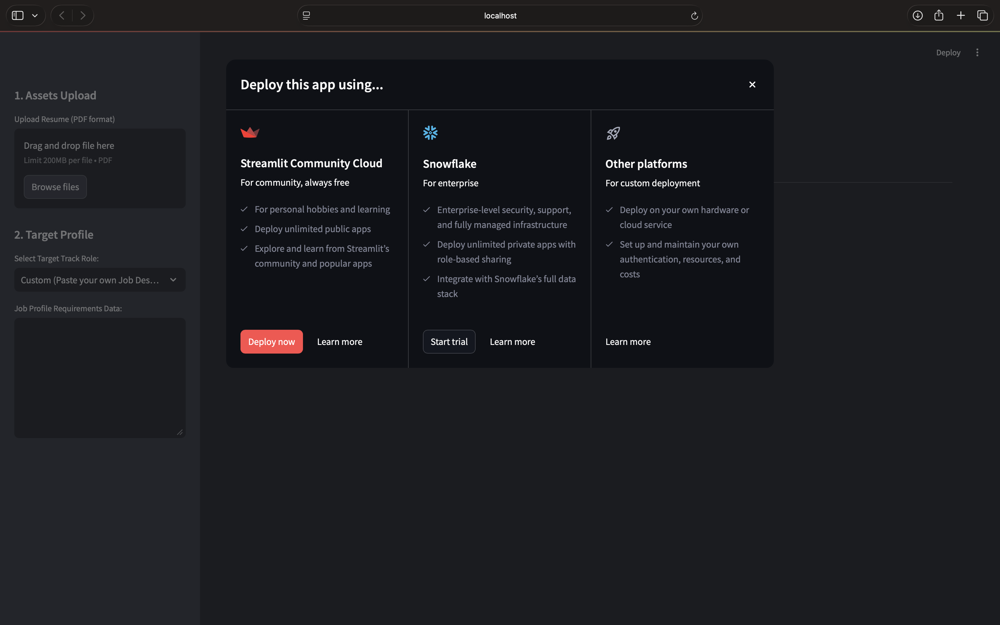

# 🤖 AI Resume Analyzer

🚀 **[Live Demo](https://nancy-ai-resume-analyzer.streamlit.app)**

A Streamlit-based resume analysis application that processes resumes and provides role-specific feedback for different internship positions.

---

## 🎯 What Problem Does It Solve?

Many resumes contain good experience but do not clearly match the requirements of a particular job.

This project helps users:

- Analyze their resume
- Compare their resume with a job description
- Identify relevant keywords
- Find missing keywords
- Calculate a resume match score
- Get suggestions for improvement

---

## ✨ Features

- 📄 Resume text extraction from PDF files
- 🎯 Job description matching
- 🔎 Keyword analysis
- 📊 Resume match score
- 💡 Resume improvement suggestions
- 🖥️ Simple and interactive web interface
- ⚡ Fast analysis using Python

---

## 🔄 How It Works

1. Upload your resume in PDF format.
2. The application extracts the resume text.
3. Enter the target job description.
4. The application analyzes the resume and job description.
5. Resume content is compared with the job requirements.
6. A match score is calculated.
7. Relevant and missing keywords are identified.
8. Suggestions are displayed to help improve the resume.

---

## 🛠️ Tech Stack

- **Python**
- **Streamlit**
- **PyPDF2**
- **Scikit-learn**

---

## 📸 Screenshots

### Dashboard

### Analysis Results

---

## 🚀 Installation

### 1. Clone the Repository
git clone https://github.com/NancySihag/ai_resume_analyzer.git

2. Navigate to the Project
cd ai_resume_analyzer

3. Create a Virtual Environment
macOS / Linux
python3 -m venv .venv
source .venv/bin/activate

Windows
python -m venv .venv
.venv\Scripts\activate

4. Install Dependencies
pip install -r requirements.txt

▶️ Run the Application
streamlit run app.py

Open the local URL shown in your terminal.
Usually:
http://localhost:8501

💻 Usage
1. Open the application.
2. Upload your resume as a PDF.
3. Enter or paste a target job description.
4. Start the analysis.
5. Review the resume match score.
6. Check relevant and missing keywords.
7. Use the suggestions to improve your resume.

🎓 Example Use Cases
This project can be useful for:
- BCA and college students applying for internships
- Students preparing resumes for specific job roles
- Entry-level job seekers
- Comparing resumes with job descriptions
- Identifying missing job-related keywords
- Improving resume relevance before applying

🧠 What I Learned
Building this project helped me gain practical experience with:
- Python application development
- Streamlit web applications
- PDF text extraction
- Natural language and keyword analysis
- Resume and job-description comparison
- Scikit-learn
- Building and deploying a real-world application

🔮 Future Improvements
Possible future improvements include:
- 🤖 More advanced AI-powered resume feedback
- 📋 Support for additional job roles
- 📄 Downloadable analysis reports
- 📈 More detailed resume scoring
- 🔍 Improved keyword and skill matching
- 🎯 ATS-focused resume analysis
- 📊 Enhanced analytics and visualizations

🌐 Live Demo
Try the application:
🚀 AI Resume Analyzer

👩‍💻 Author
Nancy Sihag
BCA Student | Python Developer | AI & Automation | Web Development
- GitHub: https://github.com/NancySihag
- LinkedIn: https://www.linkedin.com/in/nancy-sihag/

📌 Project Status
🟢 Active Project
Built as a portfolio project to demonstrate Python, Streamlit, document processing, and AI/automation development skills.

📄 License
This project is intended for educational and portfolio purposes.

**One important thing:** this assumes your repository actually has `dashboard.png`, `analysis-results.png`,`requirements.txt`, and `app.py` with those exact names. If those files are different, tell me **“check my files”** and I’ll help you make the README match your actual GitHub repository exactly.
